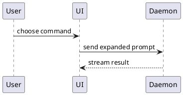
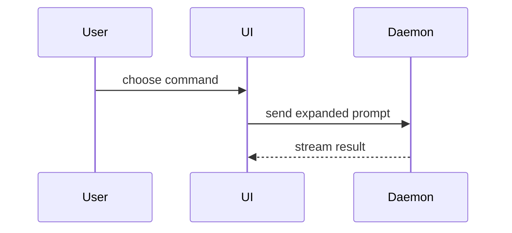

Help the user review code or understand code, a proposed code change, or a concept visually. Skip the preamble and keep prose brief. Pick the smallest view that makes the key point clear.

Choose this skill when the main goal is a focused explanation, code walkthrough, or code review. Use the rendering instructions below for diagrams that support that explanation or review. When the requested deliverable is a standalone diagram or a diagram for a document, use `diagram-tools-mcp` directly.

- Show logic or an algorithm as pseudocode:

```text
on(save)
  if content is unchanged
    return cached result
  write new content
  return fresh result
```

- Show runtime control flow as a call tree:

```text
submitForm
  createSession
    persistPrompt
    launchAgent
  navigateToSession
```

- Show UI structure as a component tree, including state and module boundaries that matter:

```tsx
<SessionPage> (apps/example/src/routes/session.tsx)
  useSessionEvents()
  <SessionToolbar>
    <RunSkillButton> (packages/ui)
```

- Show file responsibility or a broad refactor as a shallow file tree:

```text
src/
├── commands/       # parses user actions
├── sessions/       # owns session state
└── transport/      # sends API requests
```

- Show component interaction, control flow, or data flow in the code being explored or reviewed as a rendered PlantUML image. Write the diagram in PlantUML, render it, save it locally, and give the user both the local image and the live link.

1. Call `mcp__diagram-tools-mcp__diagram_get_image_url` with the raw source and `format: "png"`. Pass `@startuml ... @enduml` only — no markdown fence, no `plantuml` language tag.



2. Download it. The returned URL is Midway-gated, so it renders in the user's browser but not from a bare fetch:

```
Bash(curl -sSL -b ~/.midway/cookie -o /tmp/show-me-{description}.png '<image-url>')
```

A `307` instead of `200 image/png` means the Midway cookie is stale — tell the user to run `mwinit`, don't retry blindly.

3. Reference both, so the diagram lands whether or not the user clicks. Always use the **absolute** path — a relative one resolves against the viewer's working directory rather than the markdown file, so it silently fails to render when opened from elsewhere. Write the literal path, not `~`, which markdown renderers do not expand:

```markdown


[open in PlantUML viewer](<image-url>)
```

If the diagram is going into a file that gets saved and read later, save it beside that file rather than in `/tmp`, and reference it by absolute path all the same.

4. Then open the local copy:

```
Bash(xdg-open /tmp/show-me-{description}.png)
```

- PlantUML does not cover every diagram type. When the shape genuinely needs Mermaid (state diagrams, `gitGraph`, `mindmap`, C4), keep the fence readable inline and link the viewer — `diagram_get_image_url` rejects Mermaid, so there is no image to download and the link is the only rendered form:



[open in diagram viewer](https://console.harmony.a2z.com/mermaid-live-editor/edit#pako:...)

Get that URL from `mcp__diagram-tools-mcp__diagram_encode`, which takes the same fence-free raw source.

- Use `diff` when the point is what changes and the surrounding shape already exists. Match the diff shape to the topic.

For a component change:

```diff
 <SessionPage>
   useSessionEvents()
   <SessionToolbar>
+    <RunSkillButton />
   <SessionTimeline>
+    <SkillResultCard />
```

For a file-layout change:

```diff
 src/
 ├── commands/
+│   └── show-me.ts       # expands the slash command
 ├── sessions/
-└── transport.ts
+└── transport/
+    ├── client.ts
+    └── stream.ts
```

For a call-tree or call-stack change:

```diff
 submitForm
   createSession
     persistPrompt
+    expandSkillMention
     launchAgent
-  navigateToSession
+  navigateToSession
+    subscribeToEvents
```

For a state or control-flow change:

```diff
 on(save)
-  write content
+  if content is unchanged
+    return cached result
+  write new content
+  invalidate cache
```

- Show the whole block when most of it is new, when omitted context would hide ownership or order, or when the user needs a copyable target shape:

```ts
function expandSkill(command: string): string {
  const skillName = command.slice(1)
  return `use the ${skillName} skill`
}
```

- For a code walkthrough or review whose UI, layout, or state changes benefit from an HTML view, write one focused HTML file. Match the product's colors, type, spacing, and components; use real labels and data; support desktop and mobile. Then open it for the user:

```
Bash(xdg-open path/to/show-me-{description}.html)
```

### guidance

Place each visual next to the short text it supports. Keep only the calls, files, props, states, and boundaries needed to answer the user's current question or the options to resolve the current discussion point.

You may use one of these, you may use several, it is unlikely you will use all of them. Use your judgement and don't overwhelm the user.
